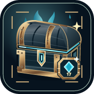

# Caja Fantasma

Tu seguimiento de recompensas, cajas y módulos Brillantes de Once Human, en **PC, Android y web**. Creado por [OscarD0823](https://github.com/OscarD0823).

## Descargar o abrir

| Plataforma | Acceso | Qué elegir |
| --- | --- | --- |
| Windows | [Descargar para PC](https://github.com/OscarD0823/Caja-Fantasma/releases/latest) | En **Assets**, el archivo `Caja-Fantasma-…-Instalador.exe`. |
| Web | [Abrir Caja Fantasma](https://oscard0823.github.io/Caja-Fantasma/) | Sin instalación. También puedes instalarla como app desde el aviso del navegador. |
| Android | [Descargar APK](https://github.com/OscarD0823/Caja-Fantasma/releases/latest) | En **Assets**, `Caja-Fantasma-Android-….apk`. Android 8 o superior, ARM64. |

Las descargas llevan a la **última versión publicada**, no a versiones en preparación. Los archivos también están organizados en [Programa](Programa/).

**1.22.0 · Conexiones juntas y consola de progreso:** PC, web y Android en un mismo apartado, conexión web–celular corregida en navegadores Android, progreso y dispositivos con energía animada, tutorial y detección automática del idioma. [Qué cambió](docs/versiones/NOTAS-VERSION-1.22.0.md) · [Historial de versiones](docs/versiones/).

## Empieza en un minuto

1. En **Caja**, pulsa **+** al reclamar una recompensa. **−** corrige un registro de la ronda actual. Los puntos se calculan automáticamente.
2. Usa **Guardar ronda** para archivar el parcial sin reiniciar el total del intento. Al obtener la caja, pulsa **¡Salió la caja!**; si llegó por correo de Plataformas, usa su botón específico.
3. En **Personajes**, crea tus perfiles o selecciona un equipo. En **Mods Brillantes**, busca el módulo, lleva sus intentos y marca los conseguidos.

No necesitas iniciar sesión. Pulsa **Tutorial** en la cabecera para recorrer las funciones. El inicio de sesión en GitHub es solo para el editor del propietario.

## Qué puedes hacer

- Contar recompensas y consultar actividad diaria, ranking e historial de cajas.
- Ver el evento público y el tiempo de la Ballena. Solo el administrador cambia la rueda y sus horarios.
- Personalizar los contadores en **Caja → Abrir configuración**. Windows ofrece una ventana flotante que deja pasar los clics al juego mientras no la estás ajustando.
- Llevar personajes por separado o sumar actividades a un equipo.
- Buscar módulos normales de nivel **1 a 17** y sus versiones **Brillantes**.
- Detectar el idioma del dispositivo o elegir entre 12 idiomas; se conserva tu elección manual. Los textos todavía sin traducción usan inglés.
- Abrir o descargar las tres plataformas y conectar con PC o celular desde **Dispositivos**, en un mismo apartado.

Los porcentajes son estimaciones de tu historial: **no garantizan una caja ni son tasas oficiales**. Una instalación nueva comienza sin historial personal precargado.

## Conectar PC, celular y web

En Windows, abre **Dispositivos → Compartir con el celular**. Conecta el teléfono y la web usando la **misma dirección, puerto y código** del PC; activa **Sincronización en vivo** para reflejar cambios en ambos sentidos.

El PC debe seguir ejecutándose y los dispositivos deben comunicarse por una red local de confianza o anclaje USB. Algunos navegadores restringen el acceso de páginas HTTPS a la red local; la web muestra instrucciones cuando ocurre. No es sincronización en la nube: no requiere Firebase ni un servicio de pago.

**Sin PC:** en la APK Android, abre **Dispositivos → Compartir con la web**. En la página, ve a **Dispositivos → Conecta tus dispositivos → Web ↔ Celular**. Escribe la IP del teléfono en sus cuatro casillas, el puerto y el código de seis números; pulsa **Conectar con el celular**. La web muestra ese botón también en un navegador Android o una PWA. Activa **Sincronización en vivo** para reflejar cambios en ambos sentidos. Ambas apps deben estar abiertas en la misma Wi-Fi de confianza. [Detalles y límites](DISENO-COFRE-Y-CONEXION-LOCAL.md).

## Cuida tu progreso

Los datos se guardan localmente. Exporta una copia JSON desde **Configuración → Respaldo local → Exportar** antes de cambiar de equipo, borrar datos del navegador o desinstalar. También puedes exportarla desde **Historial**. En Windows, **Guardar y salir** guarda y termina el programa; la **X** lo deja en la bandeja. Un corte de energía o cierre forzado puede interrumpir el último cambio.

La caché web permite abrir la interfaz sin conexión, pero **no sustituye un respaldo exportado**. GitHub distribuye el catálogo y las actualizaciones, no tu historial personal.

## Proyecto comunitario, no oficial

Caja Fantasma es una herramienta independiente y gratuita para ayudar a los jugadores, **no un producto oficial de Once Human**. No está afiliada, patrocinada ni aprobada por los responsables del juego, y no presenta la marca como propia.

El registro es manual: **no lee ni modifica archivos, memoria o procesos del juego, no se conecta a sus servidores y no automatiza partidas**. Sí incluye imágenes de referencia aportadas para reconocer eventos; esas imágenes y marcas pertenecen a sus titulares. No afirmamos ser propietarios ni tener una licencia sobre ellas. Consulta el [aviso comunitario](AVISO-COMUNITARIO.md).

El código propio usa [licencia MIT](LICENSE). Esa licencia **no concede derechos sobre recursos de terceros**.

---

[Guía técnica y funciones](GUIA-TECNICA.md) · [Android y sincronización](docs/ANDROID-Y-SINCRONIZACION.md) · [Versión web](docs/VERSION-WEB-GRATUITA.md) · [Catálogo de módulos](docs/CATALOGO-MODS-ACTUALES.md) · [Auditoría del instalador](AUDITORIA-INSTALADOR.md)
